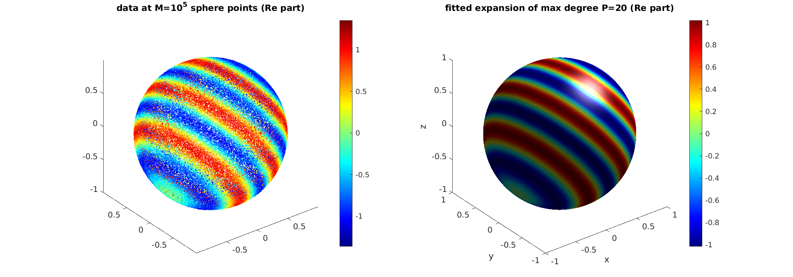

# spharm-interp

Interpolation from scattered points on the sphere via spherical harmonic expansion, in MATLAB/Octave with some Fortran.

Authors: Alex Barnett, using Fortran codes by Leslie Greengard, Zydrunas Gimbutas, Marina Spivak. 2015-2016. Repackaged 8/25/22.

The main task is to use CG to solve the normal equations for the least-squares problem of matching a global spherical harmonic expansion of given maximum degree P to given data at M scattered points on the sphere. This fitting stage costs O(M + P^3) per iteration. This expansion may then be evaluated on a regular (theta,phi) tensor-product grid on the sphere, or at arbitrary new points, currently at similar cost. There are also some helper and visualization routines. The tests are not formal unit tests, so the user has to parse the output. The drivers are in MATLAB/Octave, with a MEX library calling Fortran90 routines.


### Installation

Edit `makefile` for your system, then `make`.
If you have trouble you may want to see advice at [mwrapdemo](https://github.com/ahbarnett/mwrapdemo).
Then from MATLAB run `spharmproj_test` to test; errors should be around 1e-15
and a figure should pop up. You may also run the below `demo`, or most of the function files since they perform a self-test when called without arguments.

### Example of use



Here is a demo of fitting a scalar function (a complex plane wave) to noisy values at iid uniform random points on the sphere, in MATLAB/Octave:

```matlab

kvec = [9;2;6]; f = @(x) exp(1i*x*kvec);    % test function on R^3
M = 1e5;                                    % how many data pts on S^2
z = rand(M,1)*2-1; phi = 2*pi*rand(M,1);    % iid rand pts on S^2
rho = sqrt(1-z.^2);
x = [rho.*cos(phi), rho.*sin(phi), z];      % M*3 coords of points in R^3
ynoiseless = f(x);
sigma = 0.1;                                % additive noise level
y = ynoiseless + sigma*randn(M,1);          % make noisy data
P = 20;                                     % S.H. expansion max degree
coeffs = lsqsolvespharm(y, z, phi, P);      % fit the expansion
fSH = spharmeval(coeffs, z, phi);           % evaluate expansion at the points
rmsr = norm(fSH-y)/sqrt(M)                  % RMS residual vs data
rmse = norm(fSH-ynoiseless)/sqrt(M)         % RMS error vs underlying function
```

On a laptop this takes about 0.15 sec to fit, and 1.3 sec to evaluate the expansion. In our run the RMS residual was 0.0998 (which should be close to `sigma = 0.1`), and the RMS error in recovering the underlying function was 0.00663
(which is 15x smaller, and should be close to `sigma/sqrt(M/P^2) = 0.00632`, since `P^2` is the approximate number of degrees of freedom in the function).

For the full code with error reporting and plots see https://github.com/ahbarnett/spharm-interp/blob/main/demo.m


### Main routines available from MATLAB:

`lsqsolvespharm` : iterative LSQ solve of sph harm coeffs to match data at arbitrary scattered points on sphere  
`spharmeval` : evaluate spherical harmonic expansion at arbitrary sphere points (not yet performance code)  
`spharmgrideval` : evaluate sph harm expansion on grid (pure MATLAB version)  
`spharmgridevalf` : evaluate sph harm expansion on grid (MEX interface version)  
`spharmproj` : project grid data on the sphere onto spherical harmonic coeffs (MEX interface)  
`spharmprojfunc` : same as spharmproj but acts on function handle  
`showsphgrid` : color plot of a real function on a spherical grid  
`showspharmexp` : color plot of real part of a spherical harmonic expansion  
`demo` : example as above  
`testall` : run all tests  

Info about some other files:

`spharm.mw` : MWrap file used to generate `gateway.c` MEX interface  
`gateway.c` : MEX interface  
`*.f` : Fortran sources  


### To do

* provide non-MEX option for spharmproj
* wrap the sheval3d Fortran evaluator, test its speed
* convert to double-Fourier expansion and use FINUFFT for faster evaluation at arbitrary targets
* use the above idea to replace the sparse matvec and compare speed
* exploit Toeplitz structure in phi variable for the normal equations

